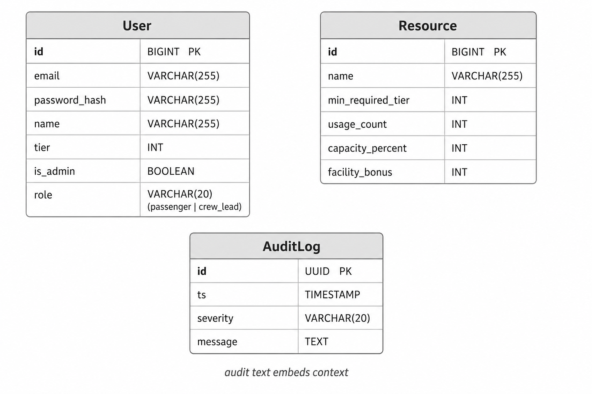
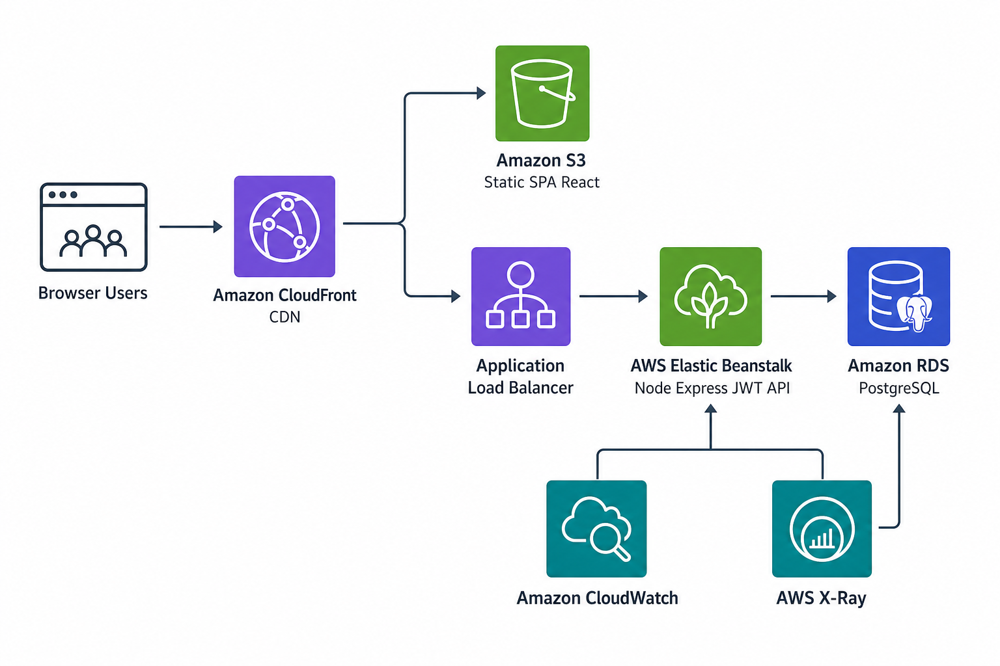

# Spaceship X26 — PRMS (Passenger Resource Management)

## Data model (PostgreSQL)

Core tables from `server/prisma/schema.prisma` — **User** (passengers and crew leads), **Resource** (facilities + minimum membership tier), **AuditLog** (usage and alerts; rows are append-only, message text carries context):



## Proposed AWS cloud architecture

Reference diagram (illustrative — tune VPC, subnets, and security groups for production). This stack is **stateless JWT + Postgres** (no Redis in-app):



### Components

| Piece | AWS service | Role |
|--------|-------------|------|
| **Web client** | **S3** (+ **CloudFront**) | Host the built SPA (`npm run build` in `web-client`). Set cache policies for `index.html` (short TTL) vs hashed assets (long TTL). Point **`VITE_API_BASE`** at the public API URL (Beanstalk/ALB). |
| **API** | **Elastic Beanstalk** | Run the Express server (Docker or Node platform). Place behind **ALB** (included in typical EB web tier). Configure **security groups** so only the EB tier talks to RDS. |
| **PostgreSQL** | **Amazon RDS** | Users, resources, audit log; same Prisma schema/migrations as local. Use Multi-AZ for production. |
| **Functions (optional)** | **AWS Lambda** + **EventBridge** | Scheduled jobs: audit export, nightly tier/report snapshots, integration hooks — *not* required for core request path. |

### Monitoring and operations

- **Amazon CloudWatch** — Log groups for **Beanstalk** instances (API logs), **RDS** performance; dashboards for CPU, memory, connections, JWT-auth error rate.
- **CloudWatch alarms + SNS** — Alert on API 5xx rate, ALB unhealthy targets, RDS free storage / high latency.
- **AWS X-Ray** — Enable on the **Beanstalk** environment for distributed traces across login → resource use → DB.
- **CloudWatch Synthetics** — **Canaries** that hit `/api/health` and a lightweight route such as `GET /api/meta/tiers`.
- **Optional:** **RDS Performance Insights** and a runbook for scaling EB / RDS during high mission traffic.

---

Mission brief Q&A (Passenger Resource Management): **[q&a.md](q%26a.md)**

Domain-driven monorepo: **Express** + **PostgreSQL (Prisma)** for persistence and auth, **React (Vite)** for Mission Control, and **ship rules** in a TypeScript domain layer. Tests may use **in-memory repositories** with `PRMS_AUTH_TEST` and `X-User-Id` headers.

**Deploy on Render (Postgres + API + static UI, or split services):** see **[RENDER.md](RENDER.md)** and root **`render.yaml`**.

## Quick start

```bash
cd spaceship-prms
npm install
cp server/.env.example server/.env
npm run db:up
cd server && npx prisma migrate deploy && npx prisma db seed && cd ..
npm run dev
```

- **API:** http://localhost:3001  
- **UI:** http://localhost:5173 (proxies `/api` to the server when using Vite defaults)  
- **Postgres:** localhost:5433  

`npm run db:up` starts **Postgres only** (see `server/docker-compose.yml`) so the local API can use port **3001**.

## Full stack in Docker (UI + API + Postgres)

Stack files: `server/Dockerfile` (API), `web-client/Dockerfile` (static UI + nginx), and `server/docker-compose.yml` (Postgres, `api`, `web`). The repo root `docker-compose.yml` includes the server stack for one-command runs.

```bash
cd spaceship-prms
npm run docker:up
# or: docker compose up -d --build
```

- **App (UI + API proxy):** http://localhost:8081  
- **API direct (optional):** http://localhost:3001  
- **Postgres:** localhost:5433  

For local development without Docker for Node, use `npm run dev` — Vite on http://localhost:5173 proxies `/api` to `localhost:3001`.

To stop: `docker compose down`

### Environment (`server/.env`)

| Variable | Purpose |
| --- | --- |
| `DATABASE_URL` | PostgreSQL connection string |
| `JWT_SECRET` | Signing key for access tokens (set a long random value in production) |
| `PORT` | API port (default `3001`) |

## Architecture: Tiers, crew leads, and audit

1. **Membership (Strategy):** `TierStrategy` enforces **Platinum ≥ Gold ≥ Silver** — higher tiers inherit access to all lower-tier resources (`server/src/domain/TierStrategy.ts`).
2. **Rule of Three:** At most **three** crew leads; promoting a fourth returns **403** (`CrewLeadRegistry`, `ruleOfThree` middleware).
3. **Resource use:** `POST /api/resources/:id/use` validates tier vs `Resource.minRequiredTier`, increments usage, and appends **AuditLog** entries (success or denied).
4. **Auth:** **JWT** on `/api/*` except health, meta tier hints, demo-account list, and `POST /api/auth/login`.

## API

| Method | Path | Purpose |
|--------|------|---------|
| POST | `/api/auth/login` | `{ email, password }` → JWT |
| GET | `/api/auth/me` | Current user from Bearer token |
| GET | `/api/health` | Liveness |
| GET | `/api/meta/tiers` | Tier metadata (public) |
| GET | `/api/meta/demo-accounts` | Demo login hints (public) |
| GET | `/api/users` | Admin: roster; passenger: self only |
| GET | `/api/resources` | List resources (Bearer) |
| POST | `/api/resources/:id/use` | Use resource if tier allows (Bearer) |
| POST | `/api/admin/crew-leads` | Crew-lead promotion (Rule of Three) |
| GET | `/api/audit` | Audit feed / search (`?q=` optional) |

## Tests

```bash
# Unit + integration (Vitest + Supertest)
npm test
```

`server/tests/setup.ts` sets `PRMS_AUTH_TEST`; protected routes accept **`X-User-Id`** in tests without JWT.

## Stack

- Node 20+, TypeScript, Vitest  
- Prisma + PostgreSQL  
- Express, JWT (bcrypt for passwords)  
- React 19, Vite, Tailwind  

## License

MIT — demo / assessment use.
